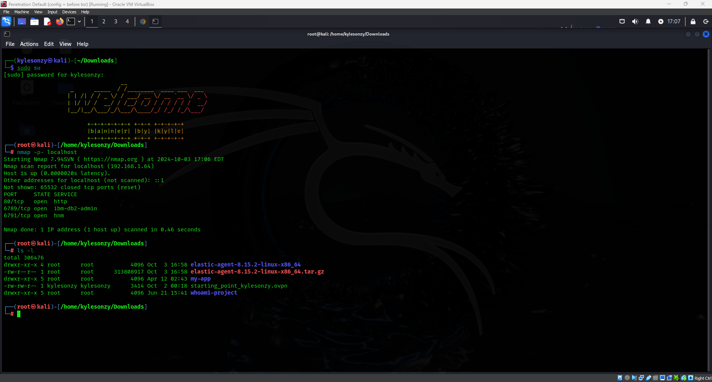
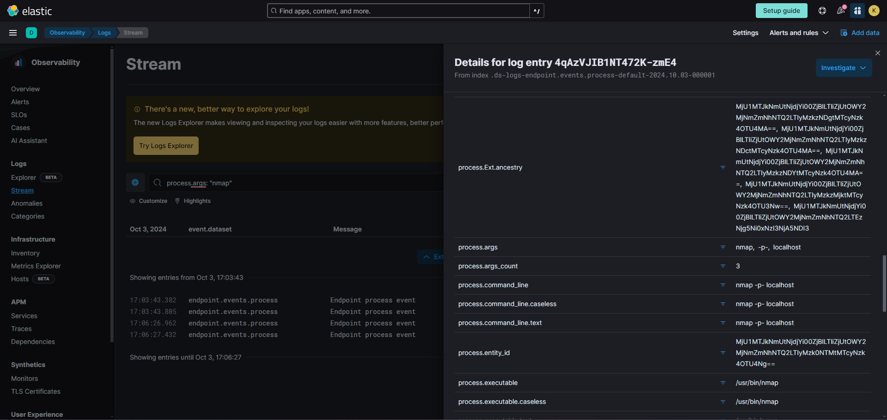
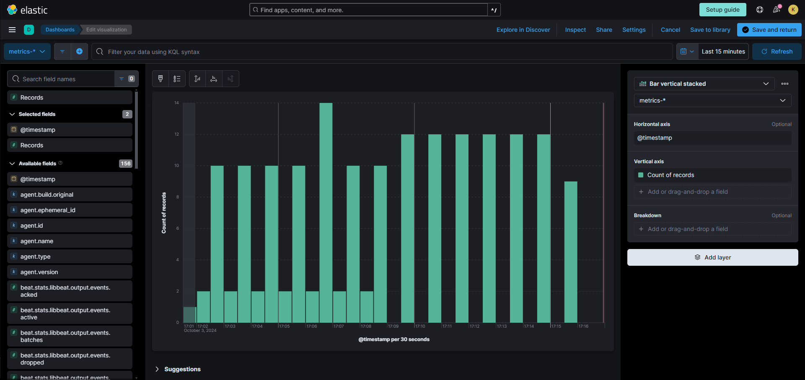
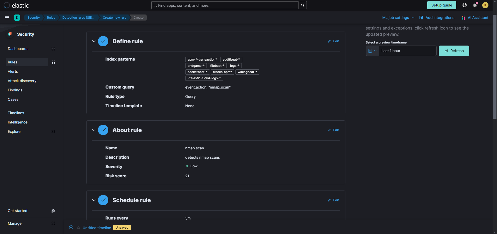
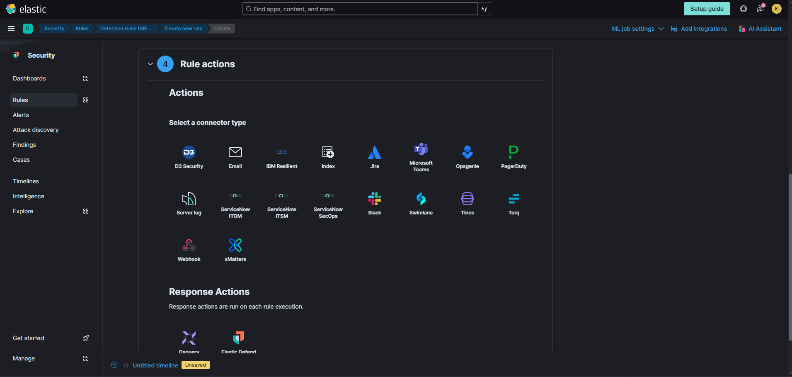
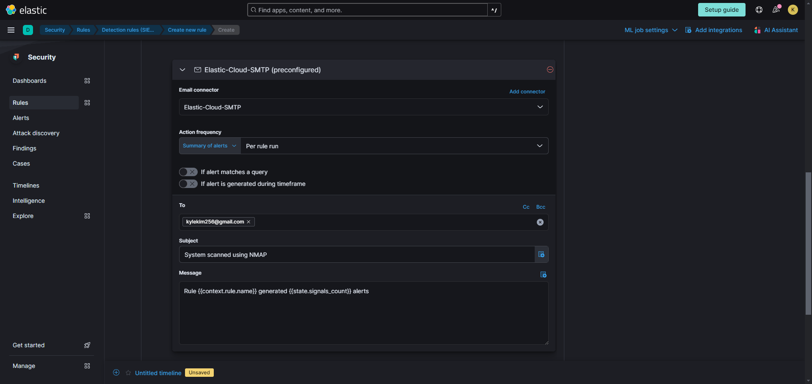

# Elastic Stack SIEM Lab Setup

This guide walks through the steps to build an Elastic Stack SIEM environment using a Kali Linux VM. You'll learn how to set up an Elastic account, configure the Kali Linux VM, install the Elastic agent, generate security events, and visualize them using Elastic SIEM.

## Prerequisites
- VirtualBox or VMware
- Basic Linux and virtualization knowledge
- Kali Linux ISO or VM

---

## Step 1: Set Up Elastic Cloud Account

1. Go to [Elastic Cloud](https://cloud.elastic.co/registration) and create a free account.
2. After signing in, click **Create Deployment**.
3. Select **Elasticsearch** as the deployment type.
4. Choose a region and deployment size, then click **Create Deployment**.
5. Wait for the deployment to complete.


---

## Step 2: Install Kali Linux VM

1. Download Kali Linux VM from [Kali's official website](https://www.kali.org/get-kali/#kali-virtual-machines).
2. Open VirtualBox or VMware, create a new VM using the Kali Linux file.
3. Start the VM and follow the instructions to install Kali.
4. Log in using `kali` as both username and password.

---

## Step 3: Install Elastic Agent on Kali VM

1. Log into your Elastic Cloud and navigate to **Integrations**.
2. Search for **Elastic Defend** and follow the instructions to install it.
3. Copy the provided installation command and run it in your Kali terminal:
   ```bash
   sudo systemctl status elastic-agent.service
   ```
4. Confirm that the agent is running.


---

## Step 4: Generate Security Events on Kali VM

1. Use **Nmap** (pre-installed in Kali) to scan your network:
   ```bash
   sudo nmap <vm-ip>
   ```
2. Run different Nmap scans to generate security events, for example:
   ```bash
   sudo nmap -sS <vm-ip>
   sudo nmap -p- <vm-ip>
   ```



---

## Step 5: Query Security Events in Elastic SIEM

1. In your Elastic Deployment, click the menu icon on the top-left and navigate to **Logs** under the **Observability** section.
2. Search for events related to Nmap scans using the following query:
   ```bash
   event.action: "nmap_scan"
   ```
3. Click **Search** to display the results.



---

## Step 6: Create a Dashboard to Visualize Events

1. Go to the **Dashboards** section in the Elastic portal.
2. Click **Create Dashboard**, then **Create Visualization**.
3. Select an area or line chart to display event counts over time.
4. Save the dashboard when finished.



---

## Step 7: Create Alerts for Nmap Scans

1. In the Elastic web console, navigate to **Security** > **Alerts**.
2. Click **Manage rules** and create a new rule.
3. Use the query below to detect Nmap scans:
   ```bash
   event.action: "nmap_scan"
   ```
4. Set the actions (e.g., email notifications) when the rule triggers.




---

## Conclusion

By following these steps, you’ve successfully set up a functioning Elastic SIEM lab with a Kali Linux VM. You can now generate security events, query logs, visualize data, and create alerts. This lab provides a great opportunity to practice security monitoring and incident response.

---

**Next Steps:**
- Experiment with different security event generation.
- Expand your Elastic SIEM setup with additional integrations and dashboards.

